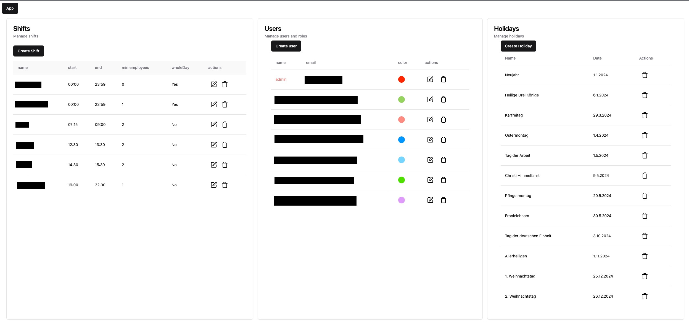
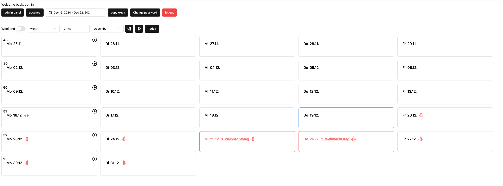
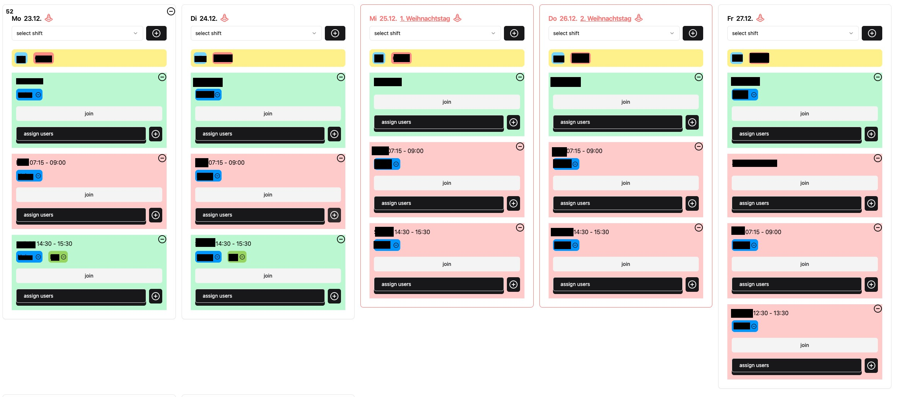

# Workshifts
## This is a web application for managing work shifts. 

### Stack:
- React
  - shadcn - UI components
  - react-query - Async operations
  - axios - Http requests
- Nestjs
  - Typeorm - ORM
- Postgres

### Features:
- Shift
    - Create, read, update and delete shifts
    - a shift has a start/end date or can be set for the whole day
- User
    - Create, read, update and delete users
    - Each user has a name, email, color and a role
- Holiday
    - Create, read and delete holidays
    - Holidays will be automatically fetched by the get.api-feiertage.de api for each year,\
      but you can also add custom holidays. \
      This data will only be used to be displayed on the calendar
- Absence
    - Each user can create an absence for a specific date range and a reason
    - Absences will be displayed on the calendar, so you can see who is not available
- Calender
    - Admin
        - Admins can add/remove shifts to the calendar and assign users to them
        - You can also copy a specific week to a specific date range, because most of the time the shifts are the same
    - User
        - Users can asign themselves to a shift if they are available and not full
        - They can also remove themselves from a shift, but only if the specified time in the .env file has not been reached\
        as example if DAYS_BEFORE_ABLE_TO_QUIT=2, the user can only remove himself from a shift 2 days before the shift starts. \
        If the shift starts in 2 days or less, the user can only remove himself if the minEmployees count is less than the current count

